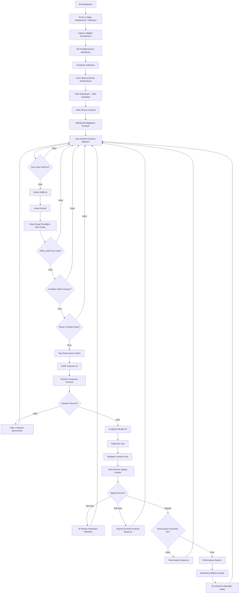
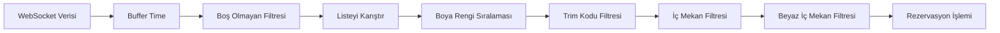
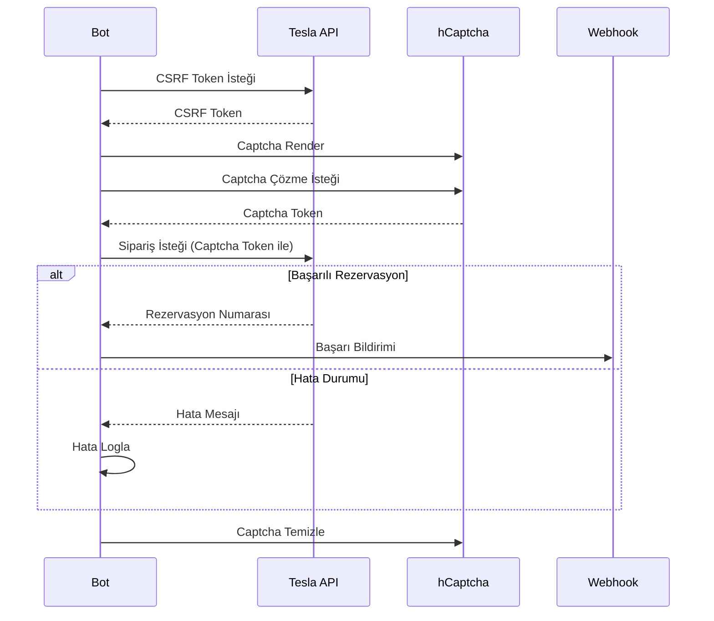
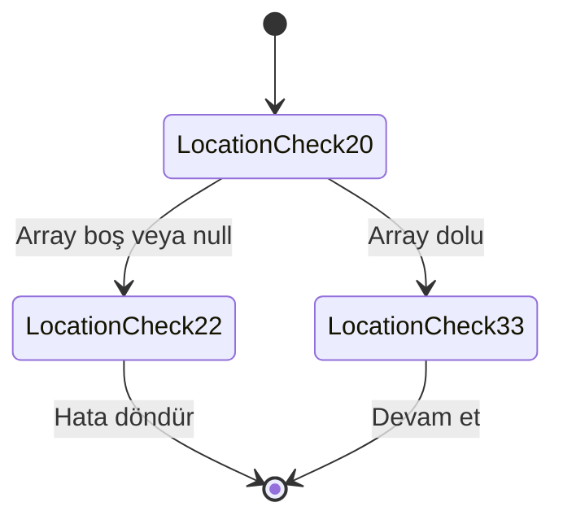
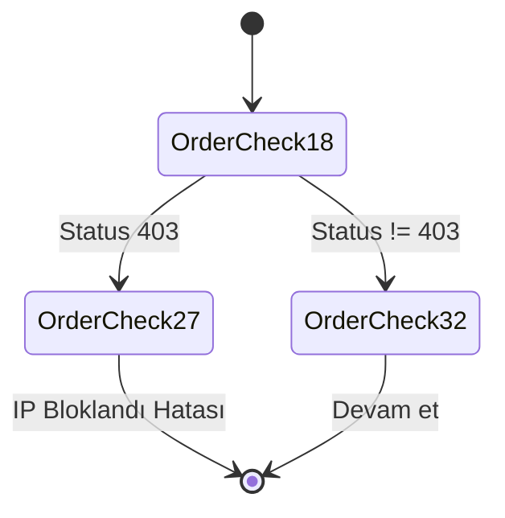
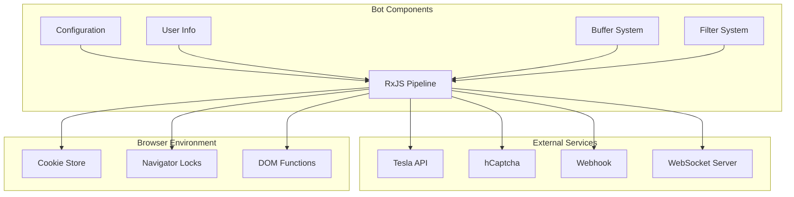

# Tesla Satın Alma Botu - Mermaid.js Diyagramı

## Ana Akış Diyagramı

## Veri İşleme Pipeline'ı

## Rezervasyon İşlemi Detayı

## State Machine Diyagramları

### Lokasyon Kontrolü State Machine

### Sipariş Durumu State Machine

## Sistem Bileşenleri

## Kullanılan Teknolojiler

- **RxJS**: Reaktif programlama ve veri akışı yönetimi
- **WebSocket**: Gerçek zamanlı araç verisi alma
- **hCaptcha**: Bot koruması aşma
- **Tesla API**: Araç rezervasyonu
- **Lodash**: Yardımcı fonksiyonlar
- **Fetch API**: HTTP istekleri
- **Navigator Locks**: Eşzamanlılık kontrolü